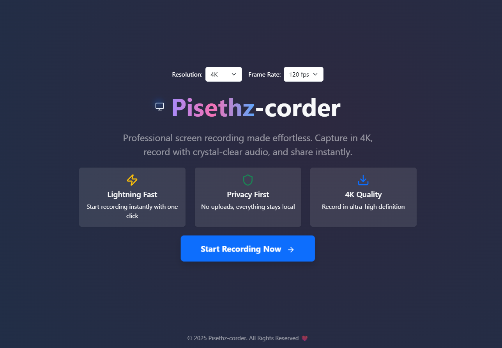

</div>

---

## 📋 Description

Pisethz-corder is a modern, high-quality online screen recorder. It allows you to record your screen in 720p, 1080p, 2K, or 4K at 30, 60, or 120 fps, with high-quality audio. The app features a beautiful, responsive UI built with ReactJS, Vite, and Bootstrap, and uses cool Lucide icons and a stylish landing page. All recordings are processed client-side for privacy and speed.


<div align="center">
  <!-- Monitor SVG icon -->
  <svg width="80" height="80" viewBox="0 0 24 24" fill="none" stroke="#6366f1" stroke-width="2" stroke-linecap="round" stroke-linejoin="round" style="margin-bottom:8px;"><rect x="2" y="3" width="20" height="14" rx="2"/><line x1="8" y1="21" x2="16" y2="21"/><line x1="12" y1="17" x2="12" y2="21"/></svg>
  <h1>Pisethz-corder</h1>
  <p>
    <b>A modern, high-quality online screen recorder</b><br>
    <i>Built with ReactJS, Vite, and Bootstrap</i>
  </p>
  
</div>

---


## 🚀 Quick Start

Clone this repository:
```bash
git clone https://github.com/Pisethz/pisethz-corder
cd pisethz-corder
npm install
npm run dev
```


## ✨ Features

<div align="center">
  <!-- Video SVG icon -->
  <svg width="32" height="32" viewBox="0 0 24 24" fill="none" stroke="#f59e42" stroke-width="2" stroke-linecap="round" stroke-linejoin="round" style="margin:0 4px;"><rect x="2" y="7" width="15" height="10" rx="2"/><polygon points="17 7 22 12 17 17 17 7"/></svg>
  <!-- Monitor SVG icon -->
  <svg width="32" height="32" viewBox="0 0 24 24" fill="none" stroke="#6366f1" stroke-width="2" stroke-linecap="round" stroke-linejoin="round" style="margin:0 4px;"><rect x="2" y="3" width="20" height="14" rx="2"/><line x1="8" y1="21" x2="16" y2="21"/><line x1="12" y1="17" x2="12" y2="21"/></svg>
  <!-- Download SVG icon -->
  <svg width="32" height="32" viewBox="0 0 24 24" fill="none" stroke="#38bdf8" stroke-width="2" stroke-linecap="round" stroke-linejoin="round" style="margin:0 4px;"><path d="M21 15v4a2 2 0 0 1-2 2H5a2 2 0 0 1-2-2v-4"/><polyline points="7 10 12 15 17 10"/><line x1="12" y1="15" x2="12" y2="3"/></svg>
  <!-- Sparkles SVG icon -->
  <svg width="32" height="32" viewBox="0 0 24 24" fill="none" stroke="#f472b6" stroke-width="2" stroke-linecap="round" stroke-linejoin="round" style="margin:0 4px;"><path d="M12 3v2m0 14v2m9-9h-2M5 12H3m15.364-6.364-1.414 1.414M6.05 17.95l-1.414 1.414m12.728 0-1.414-1.414M6.05 6.05 4.636 4.636"/><circle cx="12" cy="12" r="4"/></svg>
</div>

- 🎥 Record your screen in 720p, 1080p, 2K, or 4K
- ⚡ Choose frame rate: 30, 60, or 120 fps
- 🎵 High-quality audio with echo cancellation and noise suppression
- 🖥️ Modern, responsive UI with Bootstrap 5
- 🆒 Cool icons from [Lucide](https://lucide.dev/)
- 🖼️ Beautiful landing page and feature cards
- 📥 Download your recording instantly (WebM)
- 💻 100% client-side, privacy-first


## 🎬 Demo
<div align="center">
  
</div>

## Getting Started

### Prerequisites
- Node.js (v18 or newer recommended)
- npm

### Install
```bash
npm install
```

### Run Locally
```bash
npm run dev
```

### Build for Production
```bash
npm run build
```

### Deploy to GitHub Pages
```bash
npm install --save-dev gh-pages
```
Add to `package.json` scripts:
```
"predeploy": "npm run build",
"deploy": "gh-pages -d dist"
```
Then run:
```bash
npm run deploy
```

## Requirements
See [requirements.txt](./requirements.txt) for a list of core dependencies.

## License
MIT

---

<div align="center">
  <!-- Monitor SVG icon -->
  <svg width="40" height="40" viewBox="0 0 24 24" fill="none" stroke="#6366f1" stroke-width="2" stroke-linecap="round" stroke-linejoin="round"><rect x="2" y="3" width="20" height="14" rx="2"/><line x1="8" y1="21" x2="16" y2="21"/><line x1="12" y1="17" x2="12" y2="21"/></svg>
  <br/>
  <b>Crafted with ❤️ for creators by Pisethz.</b>
</div>
